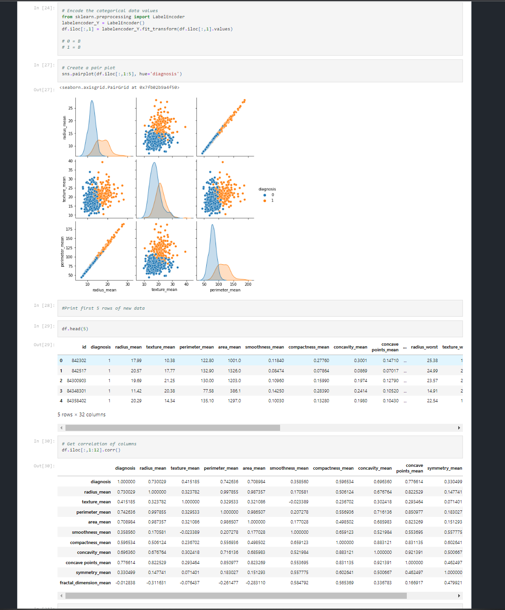
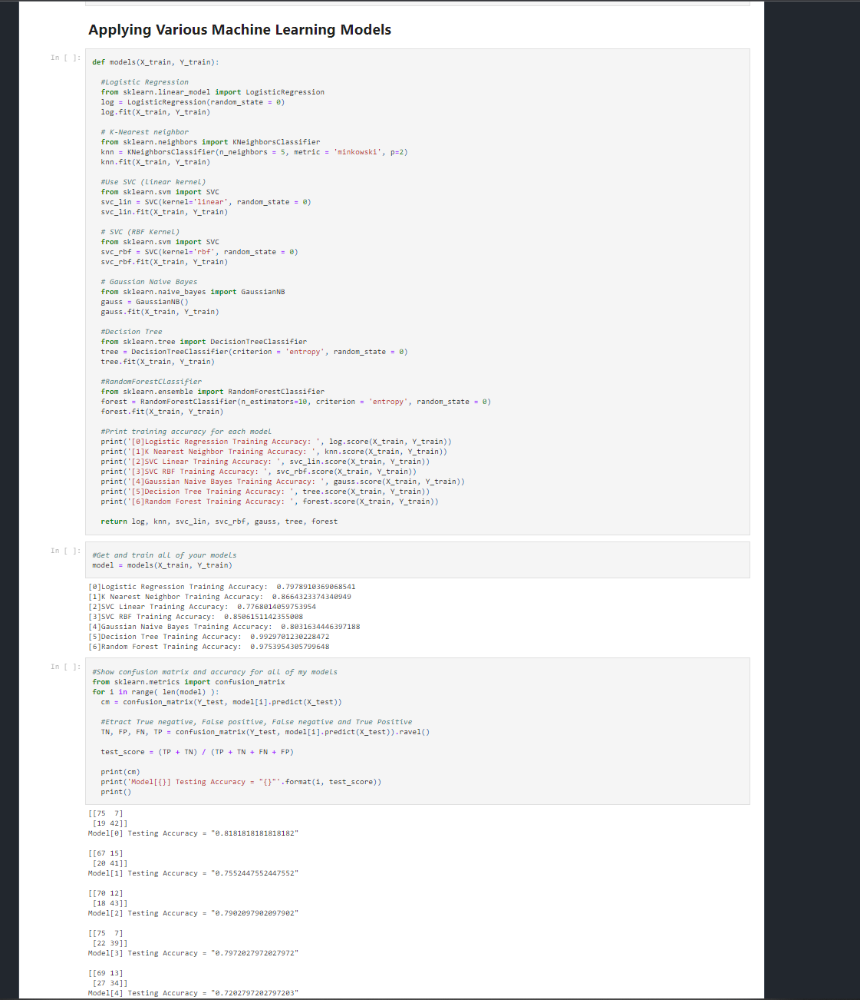

# My Machine Learning Projects
### [Breast Cancer Detector ML](https://github.com/KevinGastelum/MyMachineLearning/blob/main/breastCancer.ipynb)
<!-- -->

### [Titanic Kaggle Challenge](https://github.com/KevinGastelum/MyMachineLearning/blob/main/Titanic.ipynb)
<!-- -->

### [Crypto Price Predictor](https://github.com/KevinGastelum/MyMachineLearning/blob/main/CryptoPricePredictor.ipynb)
<!-- -->

