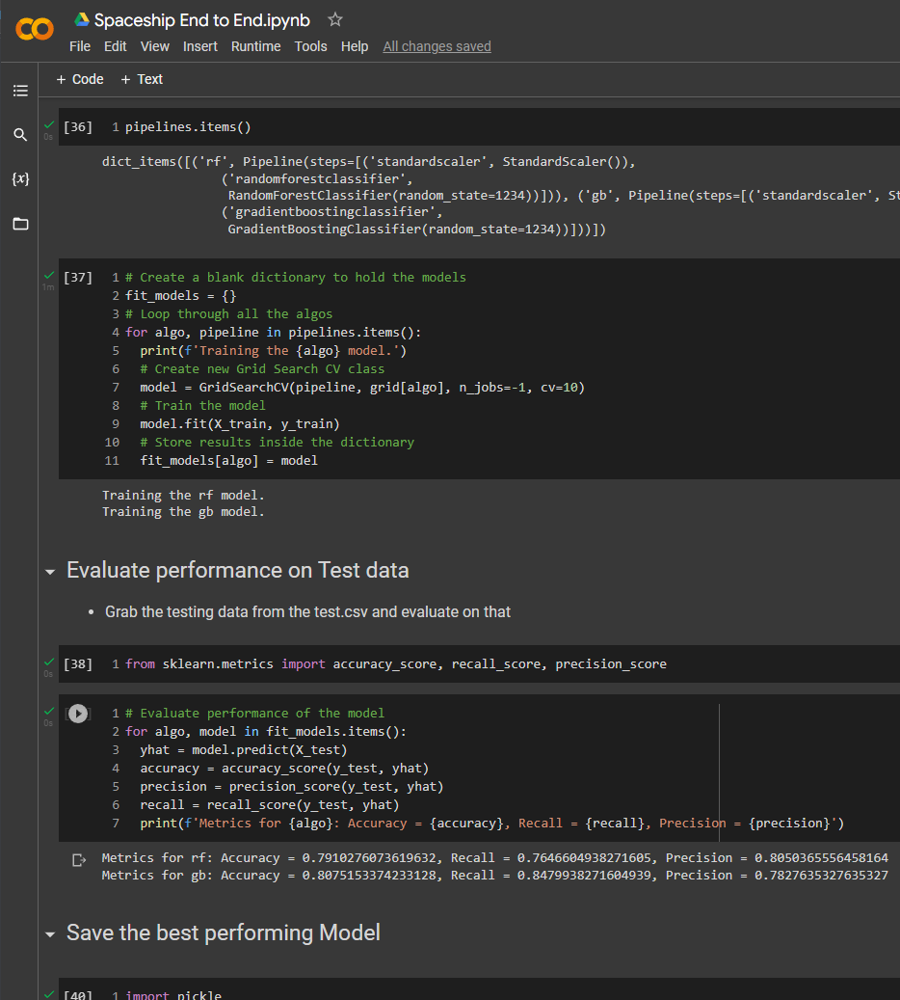

# My Machine Learning Projects
### [Breast Cancer Detector V2[Click Here to View Code]](https://github.com/KevinGastelum/MyMachineLearning/blob/main/BreastCancerDetectorV2.ipynb)

### [Spaceship Titanic Kaggle Competition [Click Here to View Code]](https://github.com/KevinGastelum/MyMachineLearning/blob/main/Spaceship_End_to_End.ipynb)

### [Crypto Price Predictor [Click Here to View Code]](https://github.com/KevinGastelum/MyMachineLearning/blob/main/CryptoPricePredictor.ipynb)
<!-- -->

### [Breast Cancer Detector ML [Click Here to View Code]](https://github.com/KevinGastelum/MyMachineLearning/blob/main/breastCancer.ipynb)
<!-- -->

### [Titanic Kaggle Challenge [Click Here to View Code]](https://github.com/KevinGastelum/MyMachineLearning/blob/main/Titanic.ipynb)
<!-- -->

